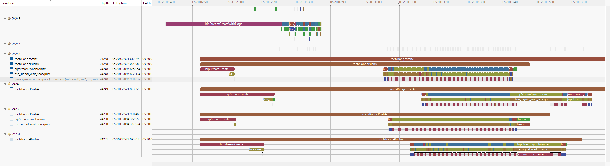

# ROCm Profiler Babeltrace2 Plugin

This plugin reads SQLite3 databases generated by ROCm profiler (rocprofv3) and converts them into babeltrace2 trace events.

## Features

- **Region Events**: Reads CPU regions with start/end timestamps and duration
- **Kernel Dispatch Events**: Reads GPU kernel execution events with dispatch details, workgroup sizes, and durations
- **Memory Copy Events**: Reads memory transfer operations between agents with size and duration information
- **Sample Events**: Reads instantaneous sampling data from CPU/GPU tracks
- **Generic Events**: Fallback handling for unrecognized events
- **Automatic Detection**: Automatically detects ROCm profiler databases and handles different table naming schemes

## Requirements

- Python 3.7+
- babeltrace2 with Python bindings
- sqlite3 (standard library)

## Installation

1. Make sure you have babeltrace2 installed:
   ```bash
   # On Ubuntu/Debian
   sudo apt-get install babeltrace2 python3-bt2
   ```

2. Install Python dependencies:
   ```bash
   pip install -r requirements.txt
   ```

3. Place the plugin file (`bt_plugin_rocm.py`) in a directory where babeltrace2 can find it

## Usage

### Basic Usage

```bash
# Read a ROCm profiler database and display events
babeltrace2 --plugin-path=. --component source.rocm.RocmSource --params='db-path="your_rocm_database.db"'

# Convert to text format with pretty printing
babeltrace2 --plugin-path=. --component source.rocm.RocmSource --params='db-path="your_rocm_database.db"' --component sink.text.pretty

# Convert to CTF format
babeltrace2 --plugin-path=. --component source.rocm.RocmSource --params='db-path="your_rocm_database.db"' --component sink.ctf.fs --params='path="output_ctf_trace"'
```

> **Note:** You can specify multiple database files in two ways:
> - Using a brace expansion pattern, e.g., `{0...3}.db`
> - Providing an explicit list, e.g., `["0.db", "1.db", "2.db"]`

### Python API Usage

```python
import bt2

# Create a plugin
plugin = bt2.find_plugin("rocm")
source_cc = plugin.source_component_classes["RocmSource"]

# Create a graph
graph = bt2.Graph()

# Add source component
source = graph.add_component(source_cc, "rocm_source", {
    "db-path": "/path/to/rocm_profile.db"
})

# Add sink component
sink_cc = bt2.find_plugin("text").sink_component_classes["pretty"]
sink = graph.add_component(sink_cc, "text_sink")

# Connect components
graph.connect_ports(source.output_ports["out"], sink.input_ports["in"])

# Run the graph
graph.run()
```

## Error Handling

The plugin handles various error conditions:

- **Missing database file**: Raises `FileNotFoundError`
- **Invalid database format**: Logs errors and continues with available data
- **Missing tables**: Gracefully handles missing optional tables
- **SQL errors**: Logs specific errors and continues processing

## Performance

- **Memory efficient**: Loads events in batches to handle large databases
- **Sorted output**: Events are sorted by timestamp for proper trace ordering
- **Database optimization**: Uses indexes for efficient querying

## Examples

The `examples` folder contains a sample rocprofv3 - rocpd database output (`24228_results.db`) and the corresponding generated CTF trace (`sample_trace/`). This allows users to quickly try out the plugin and see the conversion process in action.

Additionally, a screenshot is provided to illustrate how the converted trace appears in a trace viewer:



You can use these files to experiment with the plugin and verify its output.


## [WIP] Using a custom babeltrace2 build.
1) When configuring babeltrace2 use the following flags.
  - `./configure --prefix=$INSTAL_PREFIX --enable-python-bindings --enable-python-plugins`
2) Set your pythonpath to include the bindings for this babeltrace2 installation
  - `export PYTHONPATH=${PYTHONPATH}:$INSTALL_PREFIX/lib/{python3-version}/site-packages`
3) Now you can use the build babeltrace2.
4) So far this has been tested with babeltrace 2.0.5
   https://www.efficios.com/files/babeltrace/babeltrace2-2.0.5.tar.bz2

---

## Native CTF Emitter (barectf + Python) Build & Usage Guide

In addition to the babeltrace2 source component, this repository provides a high‑performance path to convert a rocprof/rocpd SQLite database directly into a CTF trace using `barectf` and a small C bridge (`librocpd_barectf.so`) driven by `barectf/emit_with_python.py`.

### 1. Prerequisites

Install Python dependencies (progress bar / none standard libs not required; stdlib only right now):

```bash
python3 -m pip install -r requirements.txt
```

Install `barectf` command line tool (needed only to (re)generate code if you modify `rocpd.yaml`):

```bash
python3 -m pip install barectf
```

Ensure you have a C compiler (gcc/clang) available on PATH.

### 2. Build the trace writer library

From the `barectf/` directory run:

```bash
cd barectf
make
```

This runs `barectf gen` on `rocpd.yaml` (producing `gen/` sources) and builds `librocpd_barectf.so` plus the platform implementation.

Rebuild after changes:

```bash
make clean && make
```

### 3. Emitting a CTF trace from a rocpd SQLite DB

Invoke the Python emitter (outputs a CTF `metadata` + one or more `stream*` files):

```bash
python3 barectf/emit_with_python.py \
  --db examples/24228_results.db \
  --out out_trace
```

The metadata file is copied from `barectf/gen/metadata` (generated by `make`). Stream data is written to `out_trace/stream` (and possibly suffixed variants if splitting).

### 4. Command Line Options

`--db PATH` (required)  Path to rocprof / rocpd SQLite database.
`--out DIR` (required)  Output directory; created if missing.
`--packet-bytes N`      Barectf packet size (default 262144).
`--metadata-src PATH`   Source metadata file to copy (default: generated `barectf/gen/metadata`).
`--stream-name NAME`    Base stream file name (default `stream`).
`--debug`               Print small debug summary (first events, timestamps).
`--no-sort`             Emit in collected order (faster; requires monotonic timestamps or use splitting).
`--split-on-decrease`   Start a new stream file when a timestamp regression is detected.
`--no-progress`         Disable collection/emission progress bars.
`--collect-threads N`   Parallelize in‑memory collection across views (default 1).
`--streaming`           Enable low‑memory streaming mode (no full event list retained).
`--fetch-chunk N`       Batch size for streaming DB fetch (default 2048 rows).

### 5. Performance Modes

1. In‑memory (default): Collect all events into a Python list, then (optionally) sort globally and emit.
   - Pros: Single global sort gives perfect chronological ordering.
   - Cons: High peak memory with very large DBs.

2. Streaming (`--streaming`): Iterate each view in chunks using `fetchmany()`; optionally merge with a timestamp min‑heap to maintain ordering without storing everything.
   - Use `--no-sort` to bypass heap merge and emit per-view sequentially (fastest, requires monotonic per-view or accept cross-view interleaving).
   - Memory footprint stays approximately proportional to `--fetch-chunk` × number of active views.

### 6. Splitting Streams

If timestamps decrease (e.g. interleaved clocks or unsorted input) and `--split-on-decrease` is set, the emitter closes the current stream and opens `stream_1`, `stream_2`, etc. This keeps each stream monotonically increasing for tools that assume it.

### 7. Event Duplication Model

Duration events produce paired start/end records (region, kernel dispatch, memory copy, memory allocation). Marker-only categories (e.g. `marker_core`) emit only a start. Counters (if present) emit a single record. Estimated total events accounts for this so progress is accurate.

### 8. Parallel Collection (non-streaming)

`--collect-threads N` launches one thread per populated view (regions, kernels, memory_copies, memory_allocations, counters) each with its own SQLite connection. This can reduce wall time on fast storage. The final event list is concatenated (then globally sorted unless `--no-sort`).

### 9. Low-memory Streaming Merge Strategy

With sorting enabled in streaming mode, iterators feed a min-heap keyed by timestamp; events are emitted in ascending order without retaining the full history.

### 10. Example Workflows

Fast local test (parallel collection, sorted):
```bash
python3 barectf/emit_with_python.py --db examples/24228_results.db --out trace_out --collect-threads 5
```

Lowest memory footprint (streaming + heap merge):
```bash
python3 barectf/emit_with_python.py --db examples/24228_results.db --out trace_stream --streaming --fetch-chunk 4096
```

Fastest approximate (no global ordering, per-view sequential):
```bash
python3 barectf/emit_with_python.py --db examples/24228_results.db --out trace_fast --streaming --no-sort --split-on-decrease
```

### 11. Viewing the Result

Use babeltrace2 or any CTF consumer (e.g. Trace Compass) pointing at the output directory containing `metadata` and `stream*` files.

### 12. Troubleshooting

"Emitted 0 events": Verify the DB has the expected views (`SELECT name FROM sqlite_master WHERE type='view'`).
Progress stuck early: Large counts may spend time in the first heavy view; use `--streaming` to get smoother progress.
Out-of-order warnings in tools: Try rerunning without `--no-sort` or enable `--split-on-decrease`.
Memory pressure: Prefer `--streaming` with a moderate `--fetch-chunk` (e.g. 4096) and disable in-memory mode.

### 13. Re-generating Metadata After YAML Changes

```bash
cd barectf
make clean && make
```

Then rerun the emitter (it copies the fresh `gen/metadata`).

### 14. Limitations / TODO

- Counter events currently collected but not emitted through the C bridge (bridge function signature wiring pending).
- No compression of packets; consider post-processing if storage size critical.

Contributions & improvements welcome.
